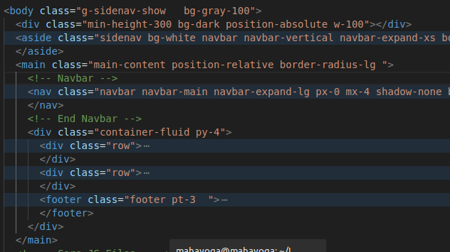
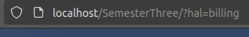

# Daftar Isi
 - [Hehe](#hal-pertama-yang-harus-diperhatikan)
 - [Tutorial Pasang Halaman Web](#cara-pasang-halaman-kalian-ke-web-tutor_pasang_halaman_web)

# Hal Pertama yang harus diperhatikan

# Cara pasang halaman kalian ke web 

Aku anggap kalian udah ubah ubah desain nya. Kalo udah kalian bisa lanjut ke step pertama.

1. Buat file di folder `pages/admin`

    Misalnya nih kalian mau buat halaman `billing`, nah kalian bikin aja di dalam folder sesuai nama halaman nya (misalnya `billing.php`).

2. Pasang desain ke halamn yang baru dibuat

    Jadi kalian sudah bikin filenya kan, kalo udah kalian pertama cari dulu bagian konten itu dimana (maksudnya letak kode yang isinya hanya daleman konten kalian). Kan didalam file HTML template nya ada beberapa bagian tuh misalnya Navbar, Sidebar, Konten Halaman sama Footer. Nah kalian cari yang bagian Konten Halaman nya. Caranya gimana? Jadi kalian tuh coba di bagi sesuai bagian bagian tadi.

    

    Penjelasan: Di dalam `body`
    - tag `aside` itu bagian Sidebar
    - tag `nav` itu bagian Navbar
    - tag `footer` itu bagian Footer

    Nah Sekarang kita liat pada bagian setelah kode komentar `<!-- End Navbar -->` itu kan dibawahnya ada tag `div` dengan class `container-fluid py-4`. Nah didalam tag itu (kecuali yang tag `footer`) itu adalah bagian desain Konten Halaman. Dalam kasus ini adalah tag `div` dengan class `row` (ada dua).

3. Ambil desain kalian dan pasang di halaman yang sudah kita buat pada folder `pages/admin` tadi

    Nah kan sekarang udah ketemu nih mana yang bagian Konten Halaman di file desain kalian. Kalo udah tau kita tinggal Copy aja yang bagian tag desain nya ke file yang baru kita buat tadi.

    

    Note: Perhatikan yang aku Copy dari file tadi ke `billing.php` cuma `div` dengan class `row` aja, karena yang `footer` itu bagian footer.

4. Akses di web

    Dan kalian bisa akses di web nya. Caranya adalah seperti ini.

    

    Note: Perhatikan bagian link nya, aku cuma tambahin `?hal=billing` di bagian link (pada parameter `hal` tadi, kita isikan sesuai nama file tadi. Kalo misalnya `billing.php` ya kita isi `?hal=billing`, contoh lagi misalnya `tables.php` berarti `?hal=tables`, gausah pake '.php').

Udah deh kalian bisa pasang desain ke webnya! awoakowakow