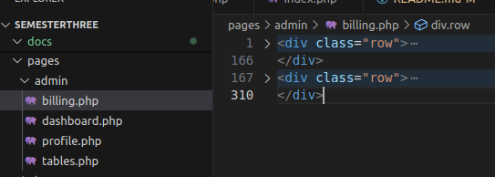

# Daftar Isi
 - [Tentang proyek ini](#tentang-proyek-ini)
 - [Cara Kontribusi](#kontribusi)
    - [Clone](#menggunakan-clone)
    - [Aturan Commit](#aturan-commit)
 - [Konfigurasi Proyek **Penting!**](#konfigurasi-proyek-penting)
 - [Tutorial Pasang Halaman Web](#cara-pasang-halaman-kalian-ke-web-tutor_pasang_halaman_web)

# Tentang Proyek Ini

Proyek ini dikerjakan untuk memenuhi syarat naik semester pada perkuliahan program studi Manajemen Informatika semester 3. Dengan adanya _repository_ ini, dibuat untuk sebuah bukti bahwa masing masing anggota dalam kelompok benar benar berkontribusi dalam proyek ini.

Beberapa anggota dalam kelompok ini yaitu:
 - (E31231392) Mahayoga Ksatria Hanafi Bahtiar (Ketua kelompok)
 - (E31231708) Muhammad Irsyadul Ibad (Anggota kelompok)
 - (E31231003) Khoirunnisa Fitrah Firdausy Prayetno (Anggota kelompok)
 - (E31231033) Ayuni Citra Lutfiah (Anggota kelompok)
 - (E31231594) Fila Indayani (Anggota kelompok)

Masing masing anggota kelompok sudah dibagi untuk mengerjakan masing masing dari fitur web yang akan dibuat dalam proyek ini (lihat detail branch).

_Website_ ini juga dibuat menggunakan _template_ yang didapatkan dari [Creative Tim - Argon Dashboard](https://www.creative-tim.com/product/argon-dashboard) dan penggunaan dari _template_ ini juga sudah gratis dan memenuhi syarat penggunaan.

# Kontribusi

Jika anda ingin berkontribusi pada proyek ini, silahkan hubungi pemilik _repository_ ini atau fork _repository_.

- #### Menggunakan Clone
    Jika anda ingin berkontribusi melalui _collaborators_ maka akan ada aturan yang berlaku.

    - Ketika anda akan membuat fitur baru atau memperbaiki salah satu fitur di dalam proyek ini, maka gunakanlah branch yang memuat salah satu fitur tersebut (jika sudah terdapat _branch_ yang memuat fitur tersebut). Jika tidak ada _branch_ yang memuat fitur tersebut, maka buatlah _branch_ baru dengan format `namauser/fitur`.

    - Jika fitur telah selesai dibuat dan akan melakukan _push_, selalu jalankan perintah _pull_ dari master ke dalam _branch_ anda. Lalu perbaiki konflik (jika ada) dan lakukan _push_ ke **DALAM** _branch_ anda sendiri.

    - Lakukanlah _pull request_ jika fitur anda dirasa sudah selesai anda kerjakan. Perubahan anda akan di _review_ oleh _codeowners_ atau pemilik repositori ini.

- #### Aturan Commit
    Terdapat aturan _commit_, yaitu.

    - Judul _commit_ harus diawali dengan tipe perubahan. misalnya jika anda mengubah sesuatu, maka gunakanlah kata `Fix` atau `Change` atau dua duanya diikuti oleh deskripsi _commit_.
    Misalnya:
    ```
    git commit -m "Fix: tampilan tabel data transaksi"
    ```

    **Note**: Deskripsikanlah pesan _commit_ lebih rinci agar anggota lain tahu apa maksud dari perubahan yang anda lakukan.

    Beberapa perintah awalan _commit_ adalah seperti berikut:
    - `Add` jika anda menambahkan sesuatu untuk perubahan (contohnya menambah file baru untuk perubahan).
    - `Fix` atau `Change` jika anda melakukan perubahan tanpa menambah atau menghapus sebuah file di dalam perubahan (contohnya hanya mengubah tampilan pada file terkait yang aan dilakukan perbahan).
    - `Delete` jika anda melakukan perubahan dengan aksi menghapus sebuah file.

    **Note**: Gunakanlah kombinasi dari perintah diatas agar lebih obyektif.


# Konfigurasi proyek (Penting)

Jika anda ingin meng-_clone_ atau _download_ proyek ini, hal pertama yang harus diperhatikan adalah:

1. Masuk kedalam folder _root_ proyek
    Setelah anda melakukan _clone_ atau mendownload proyek ini, bukalah terminal atau _command prompt_ dan jalankan perintah `cd` untuk _change directory_ ke folder _root_ proyek.

2. Menyiapkan _database_
    Mengingat proyek ini menggunakan MySQL untuk penyimpanan _database_, maka disarankan menggunakan MySQL. Setelah anda memasuki folder _root_ pada terminal, jalankan kode berikut untuk mengatur _sample_ database.

    ```
    php -f dependencies/index.php
    ```

    Setelah menjalankan kode diatas (tanpa error), anda bisa melanjutkan ke step 3.

3. Mengatur konfigurasi koneksi ke dalam server MySQL
    Hal yang akan muncul pada terminal saat menjalankan perintah pada step 2, anda akan diminta untuk menginputkan server `localhost mysql`. Inputkan saja seperti contoh.

    ```
    Masukkan localhost (database): localhost
    ```

    Pada contoh diatas adalah menginputkan `localhost`. Selanjutnya adalah username MySQL `server` kalian.

    ```
    Masukkan username (phpMyAdmin): root
    ```

    Selanjutnya adalah memasukkan _password_ (jika ada) pada input. Jika anda tidak mengatur password pada _server_ MySQL anda, maka kosongkan saja input ini.

    Contoh tanpa _password_:

    ```
    Masukkan password phpMyAdmin: 
    ```

    Contoh menggunakan _password_:

    ```
    Masukkan password phpMyAdmin: root
    ```

4. Setelah itu
    Anda sudah berhasil membuat file _config_ untuk nantinya digunakan pada saat menjalankan web ini. Selanjutnya anda bisa menggunakan `localhost` untuk menjalankan web ini.

# Cara pasang halaman kalian ke web <a id="cara-pasang-halaman-kalian-ke-web-tutor_pasang_halaman_web"></a>

Aku anggap kalian udah ubah ubah desain nya. Kalo udah kalian bisa lanjut ke step pertama.

1. Buat file di folder `pages/admin`

    Misalnya nih kalian mau buat halaman `billing`, nah kalian bikin aja di dalam folder sesuai nama halaman nya (misalnya `billing.php`).

2. Pasang desain ke halamn yang baru dibuat

    Jadi kalian sudah bikin filenya kan, kalo udah kalian pertama cari dulu bagian konten itu dimana (maksudnya letak kode yang isinya hanya daleman konten kalian). Kan didalam file HTML template nya ada beberapa bagian tuh misalnya Navbar, Sidebar, Konten Halaman sama Footer. Nah kalian cari yang bagian Konten Halaman nya. Caranya gimana? Jadi kalian tuh coba di bagi sesuai bagian bagian tadi.

    

    Penjelasan: Di dalam `body`
    - tag `aside` itu bagian Sidebar
    - tag `nav` itu bagian Navbar
    - tag `footer` itu bagian Footer

    Nah Sekarang kita liat pada bagian setelah kode komentar `<!-- End Navbar -->` itu kan dibawahnya ada tag `div` dengan class `container-fluid py-4`. Nah didalam tag itu (kecuali yang tag `footer`) itu adalah bagian desain Konten Halaman. Dalam kasus ini adalah tag `div` dengan class `row` (ada dua).

3. Ambil desain kalian dan pasang di halaman yang sudah kita buat pada folder `pages/admin` tadi

    Nah kan sekarang udah ketemu nih mana yang bagian Konten Halaman di file desain kalian. Kalo udah tau kita tinggal Copy aja yang bagian tag desain nya ke file yang baru kita buat tadi.

    

    Note: Perhatikan yang aku Copy dari file tadi ke `billing.php` cuma `div` dengan class `row` aja, karena yang `footer` itu bagian footer.

4. Akses di web

    Dan kalian bisa akses di web nya. Caranya adalah seperti ini.

    

    Note: Perhatikan bagian link nya, aku cuma tambahin `?hal=billing` di bagian link (pada parameter `hal` tadi, kita isikan sesuai nama file tadi. Kalo misalnya `billing.php` ya kita isi `?hal=billing`, contoh lagi misalnya `tables.php` berarti `?hal=tables`, gausah pake '.php').

Udah deh kalian bisa pasang desain ke webnya! awoakowakow